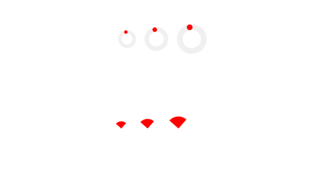

# spinner-lit
A simple spinner web component.
*beta now.*




## Usage

### Import module
    - JavaScript
    - TypeScript (**Recommmand**)
```js
// JavaScript
import 'spinner-lit/circle-spinner/circle-spinner.js'
```

```ts
// TypeScript
import 'spinner-lit/circle-spinner/circle-spinner'
```

### In HTML
```html
<circle-spinner variant="small"></circle-spinner>

<circle-spinner></circle-spinner>

<circle-spinner variant="large"></circle-spinner>
```

## Dev
### Build
Modify the ts file of the code, Start building the project

```
npm run build
```

**If the compilation of your css files <u>is skipped</u>**, please allow the following directives

```
npm run css
```

```
npm run ts
```

### Run in browser
Run the code for this project, or use Vite.

```
npm run test
```

```
npm run dev
```
